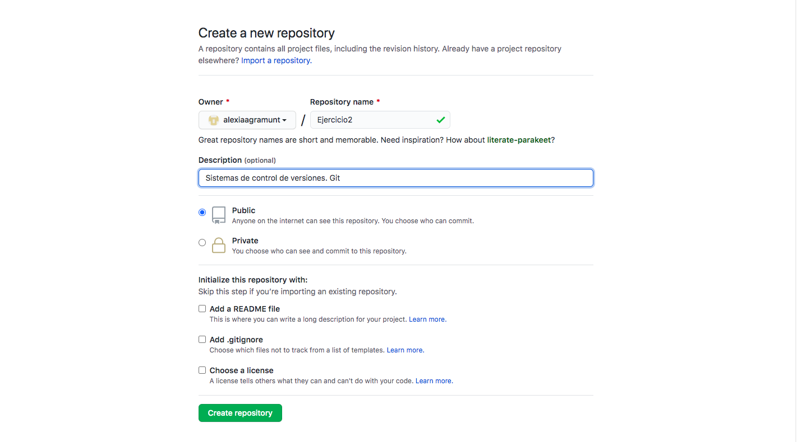
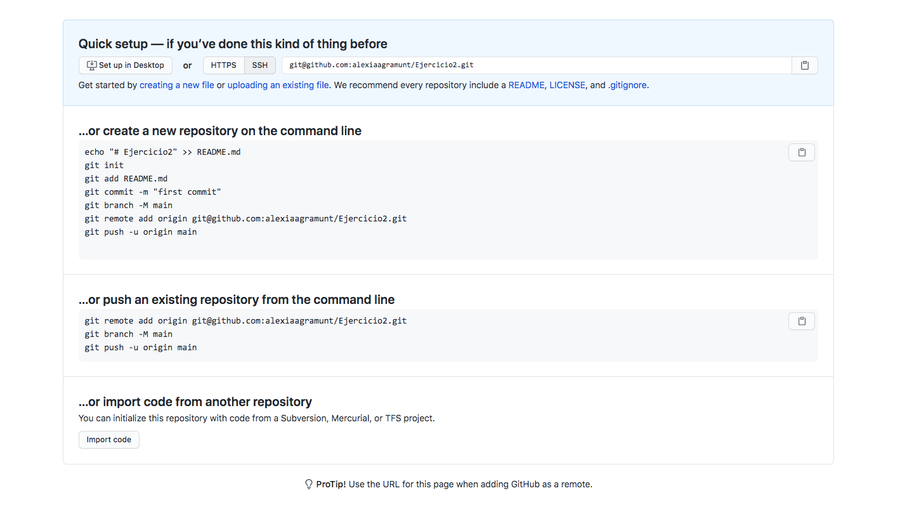
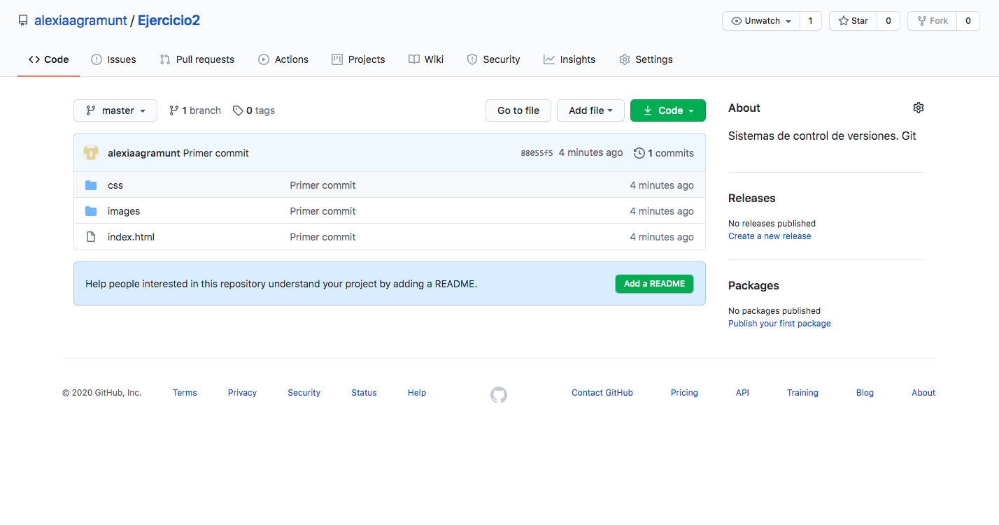

# EJERCICIO 2

>Paso 1: Crear una carpeta con el nombre del ejercicio.

~~~
mkdir Ejercicio2
~~~

>Paso 2: Utilizamos el script del ejercicio anterior para crear los archivos necesarios para un proyecto para una web estática.

~~~
./Ejercicio1/script.sh Ejercicio2
~~~

>Paso 3: Inicializa un repositorio git en la carpeta creada. Accedemos a la carpeta y usamos el comando git init para inicializar el repositorio.

~~~
$ cd Ejercicio2
$ git init
~~~

>Paso 4: Incluye todos los archivos en el control de versiones, y guarda los cambios en el repositorio local (commit) con el mensaje “primer commit”. Añadimos al repositorio todos los archivos, miramos con el git status, el estado en el que se encuentran, y finalmente guardamos todos los cambios realizados usando el comando git commit...

~~~
$ git add .
$ git status
$ git commit -m "Primer commit"
~~~

>Paso 5: Creamos un nuevo repositorio en github para alojar el código de este proyecto.

_Captura1_

_Captura2_

>Paso 6: Configuramos el repositorio local añadiendo el repositorio remoto de github. Una vez hecho esto, sube los cambios del repositorio local al remoto (push).

~~~
$ git remote add origin git@github.com:alexiaagramunt/Ejercicio2.git

$ git push -u origin master
~~~

_Captura actualizada_

>Paso 7: Ahora añadimos el archivo README.md al proyecto y copia en él la documentación que has generado hasta ahora. Movemos el archivo del escritorio a la carpeta anteriormente creada.

~~~
$ mv Desktop/README.md Desktop/DAW/DAW/Ejercicios/Ejercicio2/README.md
~~~

>Paso 8: Confirmamos los cambios (commit) y actualizamos el repositorio remoto (push). Comprobamos que github muestra ahora el contenido del archivo README.md en la página principal del repositorio.

